<!--
  Profile README: repo named exactly after the username (AyrXZ47) so GitHub
  lo muestra en el perfil. El retrato (370) y la info card (490) comparten
  altura: si cambias H en make_info_card.py, re-ajusta estos widths.
-->

<table>
<tr>
<td valign="top"></td>
<td valign="top"></td>
</tr>
</table>

## Yovick R. Z.

**Desarrollo de sistemas · Cohetes y aviónica · NixOS**

<!-- Social: una insignia por red, logo + usuario en un solo bloque de color -->

 

<!-- grafo de contribuciones animado, refrescado a diario por el workflow -->

